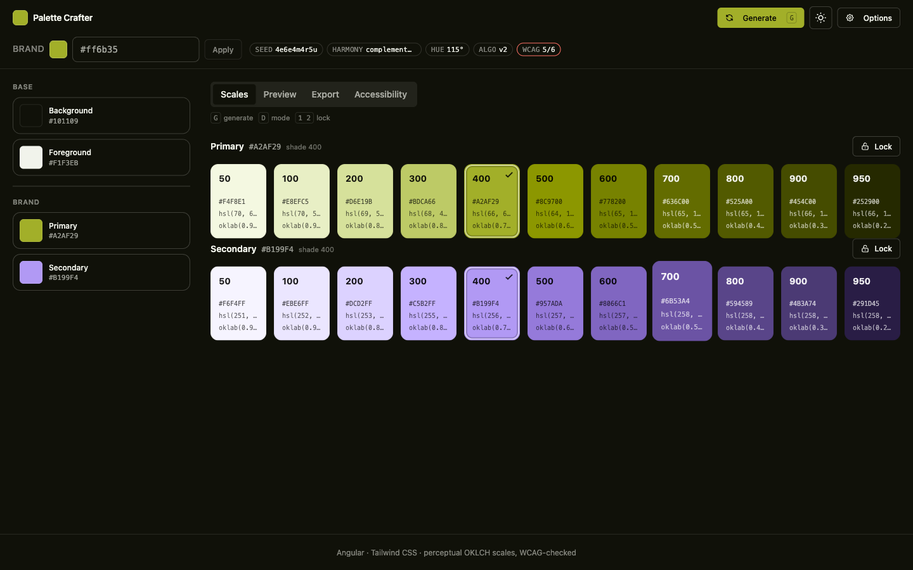
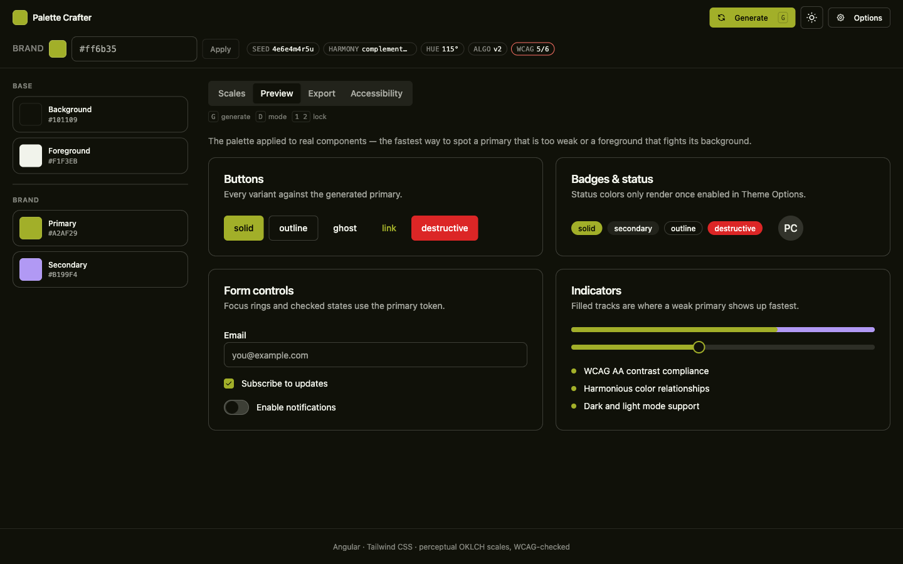
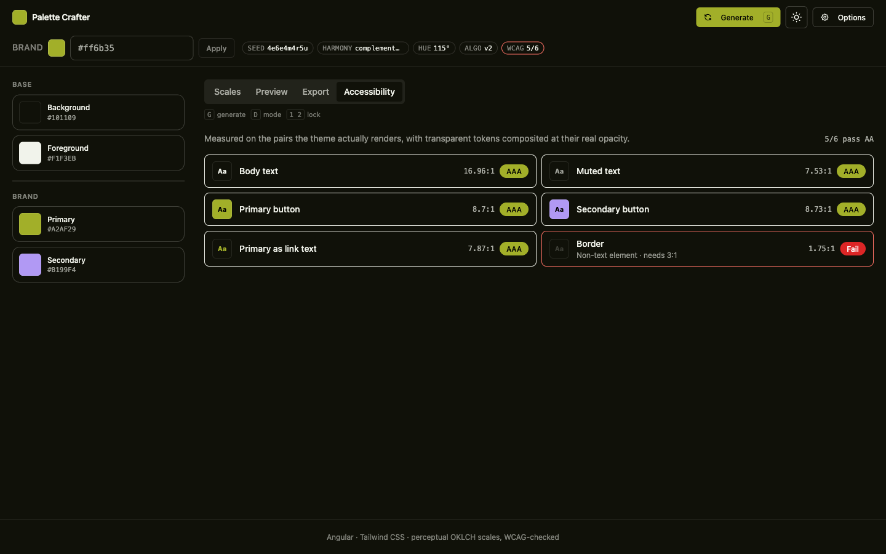
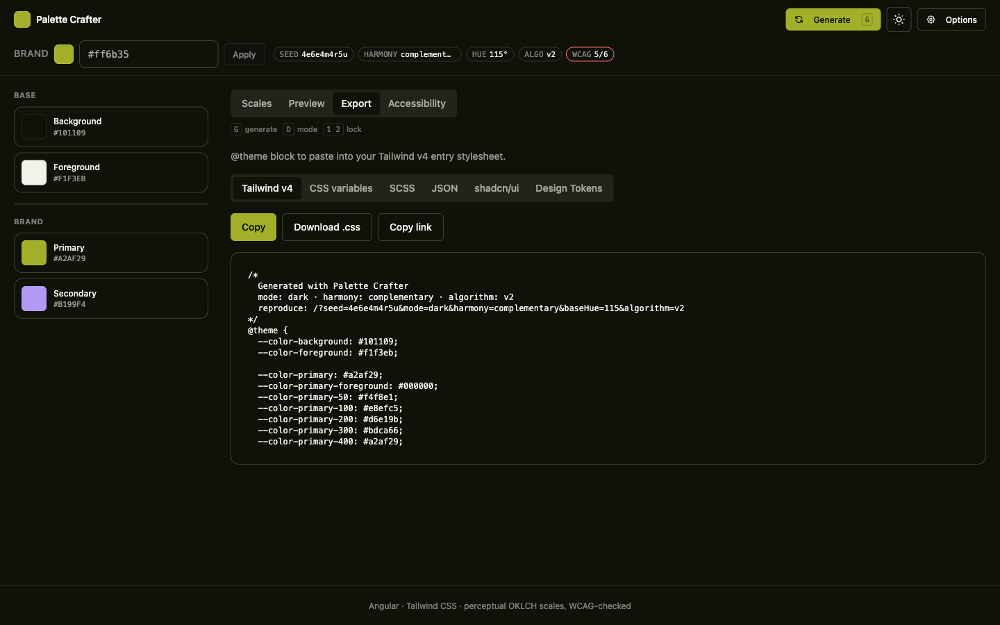
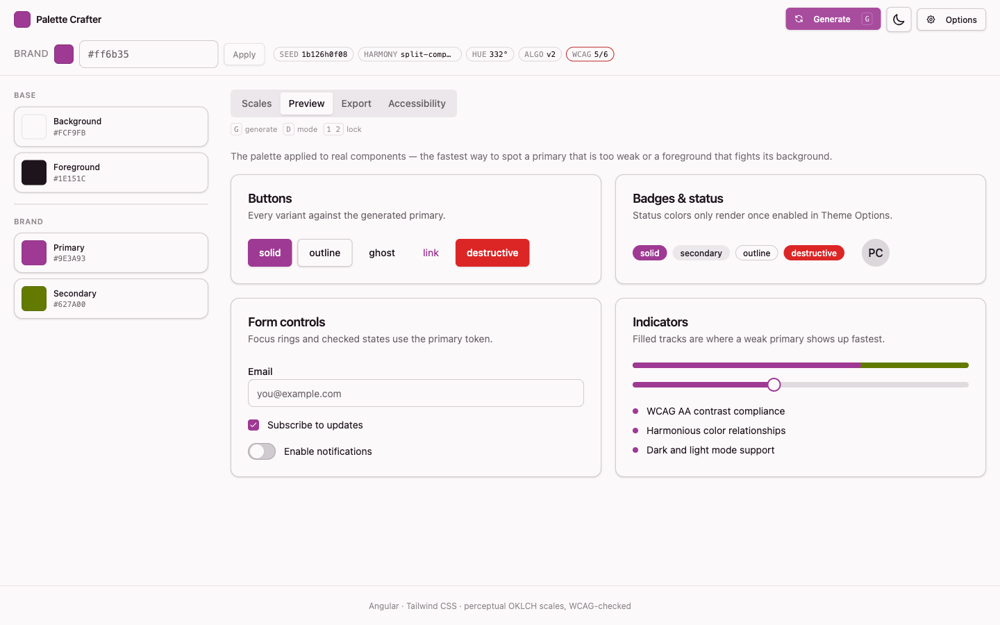

<div align="center">

# 🎨 Palette Crafter

**Deterministic, accessible color palettes — a visual playground _and_ an HTTP API.**

Both run the exact same generator, so a palette is identical whether you click for it or `curl` it.

<br/>

[](https://angular.dev)
[](https://analogjs.org)
[](https://tailwindcss.com)
[](https://www.typescriptlang.org)
[](https://palette-crafter.pages.dev)
[](#-license)

<br/>

### [🌐 Live demo](https://palette-crafter.pages.dev) · [⚡ HTTP API](#-http-api) · [📦 Export formats](#-export-formats)

<br/>



</div>

---

## ✨ Highlights

- 🎯 **Deterministic** — the same `seed` always returns the same palette. Share a link, get the exact colors back.
- 🌈 **Perceptual OKLCH scales** — 50 → 950 shades with chroma tapering and gamut mapping that never shifts hue.
- 🎨 **Your brand hex, preserved exactly** — pass `baseColor` and your real color appears verbatim in the scale.
- ♿ **WCAG-audited, not assumed** — every pair the theme actually renders is measured and graded AA/AAA.
- 📦 **Seven export formats** — Tailwind v4, CSS variables, SCSS, JSON, shadcn/ui, Volt UI, and W3C Design Tokens.
- ⚡ **Edge-cacheable API** — `GET`/`POST`, CORS-enabled, deployed on Cloudflare Pages.
- 🌗 **Light & dark** — both modes generated from the same intent, each contrast-checked on its own.

---

## 🖼️ A look around

<table>
  <tr>
    <td width="50%">
      <strong>🧩 Preview — the palette on real components</strong><br/>
      
    </td>
    <td width="50%">
      <strong>♿ Accessibility — per-pair WCAG audit</strong><br/>
      
    </td>
  </tr>
  <tr>
    <td width="50%">
      <strong>📦 Export — copy-paste ready output</strong><br/>
      
    </td>
    <td width="50%">
      <strong>🌗 Light mode — same intent, re-checked</strong><br/>
      
    </td>
  </tr>
</table>

---

## 🚀 Quick start

> Requires **Node.js 20+** and **pnpm 10+**.

```bash
pnpm install
pnpm dev            # http://localhost:4200
```

### 🎛️ Scripts

| Script            | What it does                                     |
| ----------------- | ------------------------------------------------ |
| `pnpm dev`        | Local development server.                        |
| `pnpm build`      | Production build.                                |
| `pnpm test`       | Run the test suite (`pnpm test:watch` to watch). |
| `pnpm build:cf`   | Build targeting the Cloudflare Pages preset.     |
| `pnpm dev:cf`     | Local Cloudflare Pages preview.                  |
| `pnpm deploy:cf`  | Deploy to Cloudflare Pages.                      |
| `pnpm clean`      | Remove build artifacts and the Angular cache.    |

---

## ⚡ HTTP API

Two versions, both accepting `GET` and `POST`:

| Route            | Algorithm | Use it for                                  |
| ---------------- | --------- | ------------------------------------------- |
| `/api/v1/theme`  | `v1`      | Existing integrations. **Frozen forever.**  |
| `/api/v2/theme`  | `v2`      | Everything new.                             |
| `/api/v2/theme-family` | `v2` | Tooling that needs coherent light + dark themes. |

`v1` is frozen — a seed that worked a year ago returns exactly the same colors today, and always will.
`v2` is the current algorithm: perceptual OKLCH scales, your brand hex preserved exactly, and AAA-level body text.

### Parameters

Accepted in the query string or a JSON body.

| Param       | Values                                                              | Notes                                                      |
| ----------- | ------------------------------------------------------------------ | ---------------------------------------------------------- |
| `mode`      | `light` \| `dark`                                                  | Defaults to `light`.                                       |
| `seed`      | string (≤256 chars) \| number                                      | Same seed ⇒ same colors. Omit it for a random one.         |
| `baseHue`   | `0..360`                                                           | Ignored when `baseColor` is given.                         |
| `baseColor` | hex, e.g. `#ff6b35` or `#f63`                                       | **v2 only.** Appears verbatim in the generated scale.      |
| `harmony`   | `analogous` \| `complementary` \| `split-complementary` \| `triadic` | Picks the secondary hue.                                   |
| `algorithm` | `v1` \| `v2`                                                       | Overrides the route default.                               |
| `format`    | see [Export formats](#-export-formats)                             | Returns a rendered file instead of JSON.                   |
| `contrast`  | `true`                                                             | Adds the WCAG audit to the response.                       |

`/api/v2/theme-family` accepts the same inputs except `mode`, because it returns both modes from one shared identity. Its JSON response includes `contractVersion: 1` separately from `algorithm`, so tooling can pin the response shape without confusing it with the color algorithm.

Every invalid value returns `400` with a message saying what was wrong — including an unparseable `baseHue`, which is never silently ignored.

### Examples

```bash
# Deterministic: this returns the same colors every time.
curl -s "https://palette-crafter.pages.dev/api/v2/theme?seed=brand-a&mode=dark&harmony=triadic"

# Build a palette around your actual brand color.
curl -s "https://palette-crafter.pages.dev/api/v2/theme?baseColor=%23ff6b35"

# Get a ready-to-paste Tailwind v4 @theme block.
curl -s "https://palette-crafter.pages.dev/api/v2/theme?seed=acme&format=tailwind" > theme.css

# Include the accessibility audit.
curl -s "https://palette-crafter.pages.dev/api/v2/theme?seed=acme&contrast=true"

# Get a light + dark pair for creator/tooling integrations.
curl -s "https://palette-crafter.pages.dev/api/v2/theme-family?seed=acme&baseColor=%23ff6b35"

# Get Volt UI CSS with :root and .dark blocks.
curl -s "https://palette-crafter.pages.dev/api/v2/theme-family?seed=acme&format=volt" > volt-theme.css

# POST works too.
curl -sS -X POST "https://palette-crafter.pages.dev/api/v2/theme" \
  -H "Content-Type: application/json" \
  -d '{"mode":"light","seed":"landing-v1","harmony":"complementary"}'
```

### CORS & caching

- `Access-Control-Allow-Origin: *`, with `OPTIONS` preflight answered `204`. The API is public, read-only, and carries no credentials.
- Seeded requests are deterministic and therefore cacheable: `public, max-age=3600, s-maxage=86400, stale-while-revalidate=604800`.
- Unseeded requests are random and served `no-store`.

<details>
<summary><strong>Response shape</strong></summary>

```json
{
  "ok": true,
  "theme": {
    "bg": "#faf9fc",
    "fg": "#1a1620",
    "primary": {
      "50": "#...", "100": "#...", "200": "#...", "300": "#...",
      "400": "#...", "500": "#...", "600": "#...", "700": "#...",
      "800": "#...", "900": "#...", "950": "#...",
      "DEFAULT": "#...",
      "foreground": "#..."
    },
    "secondary": { "…": "same shape" },
    "status": {
      "info": { "…": "same shape" },
      "success": { "…": "same shape" },
      "warning": { "…": "same shape" },
      "danger": { "…": "same shape" }
    }
  },
  "meta": {
    "mode": "light",
    "baseHue": 210,
    "secondaryHue": 30,
    "harmony": "complementary",
    "seeded": true,
    "algorithm": "v2",
    "seed": "landing-v1"
  }
}
```

`meta` may gain fields over time; `theme` is stable per algorithm version.

</details>

---

## 📦 Export formats

Available in the playground and through `?format=` on the API. All of them emit **literal color values**, so a pasted snippet works without anything else from this project.

| `format`         | Output                                             |
| ---------------- | -------------------------------------------------- |
| `tailwind`       | Tailwind v4 `@theme` block                         |
| `css`            | Plain custom properties on `:root`                 |
| `scss`           | SCSS variables plus a `$palette` map               |
| `json`           | The raw theme payload                              |
| `shadcn`         | Semantic tokens in the shape shadcn/ui expects     |
| `volt`           | Semantic tokens matching Volt UI's theme contract  |
| `design-tokens`  | W3C Design Tokens, for Figma and Style Dictionary  |

For `/api/v2/theme-family`, `format=volt` returns a complete CSS file with `:root` for light mode and `.dark` for dark mode.

---

## ♿ Accessibility

Contrast is **measured, not assumed**. `buildContrastReport` audits the pairs the theme actually renders — including semi-transparent tokens composited at their real opacity — and grades each against WCAG AA/AAA. When a pair falls short, it names the scale shade that _would_ pass instead of just reporting a failure.

In `v2` the body-text pair targets 7:1 (AAA), and the primary button label resolves to the same color for every hue, so palettes from the same tool never disagree with each other.

---

## 🧱 Stack

- **Angular 21** — standalone components, zoneless.
- **AnalogJS** — SSR + file-based routing + API routes.
- **Vite + Nitro** — build and server runtime.
- **Tailwind CSS v4** — styling.
- **Cloudflare Pages** — deployment via Wrangler.

### 🗂️ Project structure

```
src/shared/           → pure logic: color math, generator, exports, contrast
                        (no Angular/DOM imports — runs in browser, SSR, and Worker)
src/server/handlers/  → shared API logic (validation, CORS, caching)
src/server/routes/    → thin route files for /api/v1 and /api/v2
src/services/         → Angular signal state; generates in-process
src/components/       → standalone playground UI components
src/app/pages/        → AnalogJS file-based routes
```

The golden rule: **the playground and the API can never diverge**, because they literally call the same `generateTheme` function.

---

## ☁️ Deployment

Palette Crafter deploys to **Cloudflare Pages** — no infrastructure of our own to maintain.

A GitHub Action ([`.github/workflows/deploy-cloudflare.yml`](.github/workflows/deploy-cloudflare.yml)) deploys on every push to `main`. It needs two repository secrets: `CLOUDFLARE_API_TOKEN` and `CLOUDFLARE_ACCOUNT_ID`.

To build and deploy from your machine instead:

```bash
pnpm wrangler login   # once
pnpm dev:cf           # build and preview locally
pnpm deploy:cf        # deploy
```

---

## 🤖 For AI agents

Start at [AGENTS.md](./AGENTS.md) — it points to project context, current state, and repo-specific conventions in [`docs/`](./docs). Before changing the generator, read [docs/CONVENTIONS.md](./docs/CONVENTIONS.md) rule 2: `v1` output is frozen, and there is a test that will catch you.

---

## 📄 License

[MIT](./LICENSE) © [Andrii Pap](https://github.com/Andersseen)
